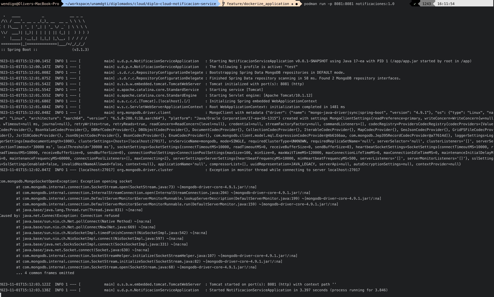

# Getting Started

## Project

Implementation of notification microservice for the Pixup application.
The notification will be created for the following event:
- User Register

The following scripts are provided for the MongoDB database/collections creation:
* notificaciondb_creation.js
* tipo_notificacion_collection.js

## Deploy

### Creating the image

This image is based on [arm64/jdk-17](https://hub.docker.com/layers/arm64v8/openjdk/17-ea-16-jdk/images/sha256-149f7dbd5287cb06efc8c5d0dfffeffcc36e8a9872dca7736ef8c333a3eca6a2?context=explore) for Mac OS. 

The complete specification of the image that contains the application is in the [Dockerfile](./Dockerfile)

### Building the image.

Build the image using `docker` or `podman`, below the commands for using `podman`. More information on how to use it [here](https://podman.io/). First version is tagged as `notificaciones:1.0` 

`podman build -t notificaciones:1.0 .`

### Running the application

Run the application image into a container in `podman`, use the next command:

`podman run -p 8081:8081 notificaciones:1.0`

The expected output after the previous command looks like this:



### Publishing 

Publish the image in a __docker hub__ account using the next command. 

> [!Important]
> If you are not logged in to the hub, use the login command: `podman login docker.io -u {myuser}` then type the password.  

`podman push cafaray/notificaciones:1.0`

## Test

Execute the next `curl` command to validate the deploy of the service. 

```shell
curl -X 'POST' \
  'http://localhost:8081/api/notificaciones/usuario' \
  -H 'accept: application/json' \
  -H 'Content-Type: application/json' \
  -d '{
    "idUsuario": "64f76d1d08199c722d6bc041",
    "email": "urielhdezorozco@yahoo.com.mx"
}' 
```

The expected result should looks like:

```
{
    "id": "65172566daeae0673186f249",
    "fechaNotificacion": "2023-09-29T13:28:38.327-06:00",
    "idUsuario": "64f76d1d08199c722d6bc041",
    "email": "urielhdezorozco@yahoo.com.mx"
}
```
 
### Reference Documentation
For further reference, please consider the following sections:

* [Official Apache Maven documentation](https://maven.apache.org/guides/index.html)
* [Spring Boot Maven Plugin Reference Guide](https://docs.spring.io/spring-boot/docs/2.7.15/maven-plugin/reference/html/)
* [Create an OCI image](https://docs.spring.io/spring-boot/docs/2.7.15/maven-plugin/reference/html/#build-image)
* [Spring Web](https://docs.spring.io/spring-boot/docs/2.7.15/reference/htmlsingle/index.html#web)
* [Spring Data MongoDB](https://docs.spring.io/spring-boot/docs/2.7.15/reference/htmlsingle/index.html#data.nosql.mongodb)

### Guides
The following guides illustrate how to use some features concretely:

* [Building a RESTful Web Service](https://spring.io/guides/gs/rest-service/)
* [Serving Web Content with Spring MVC](https://spring.io/guides/gs/serving-web-content/)
* [Building REST services with Spring](https://spring.io/guides/tutorials/rest/)
* [Accessing Data with MongoDB](https://spring.io/guides/gs/accessing-data-mongodb/)

